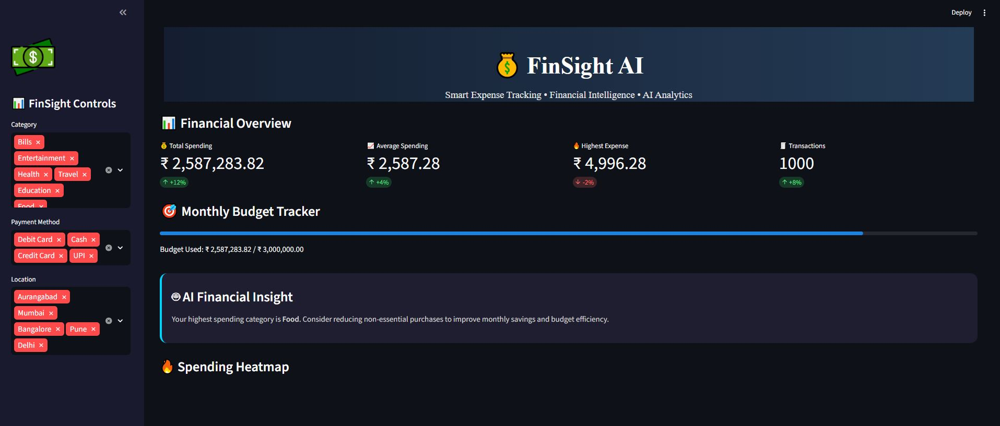
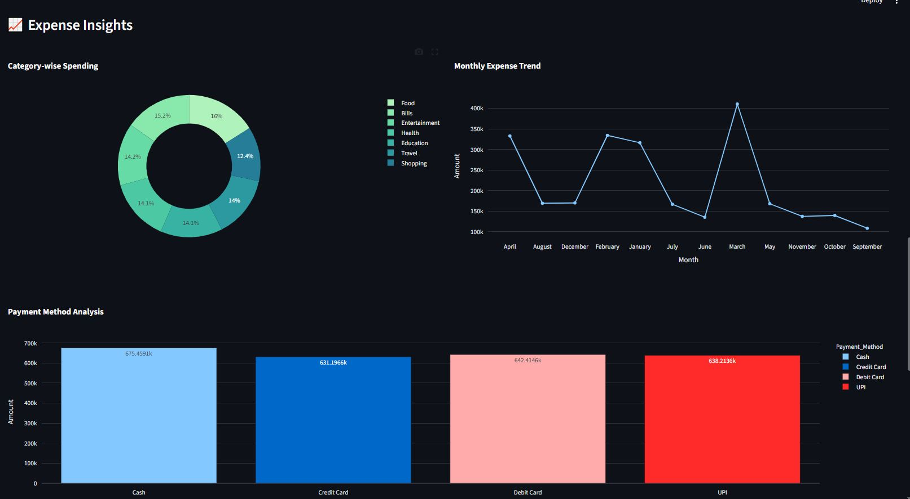
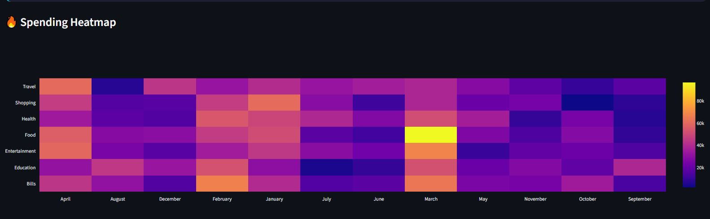
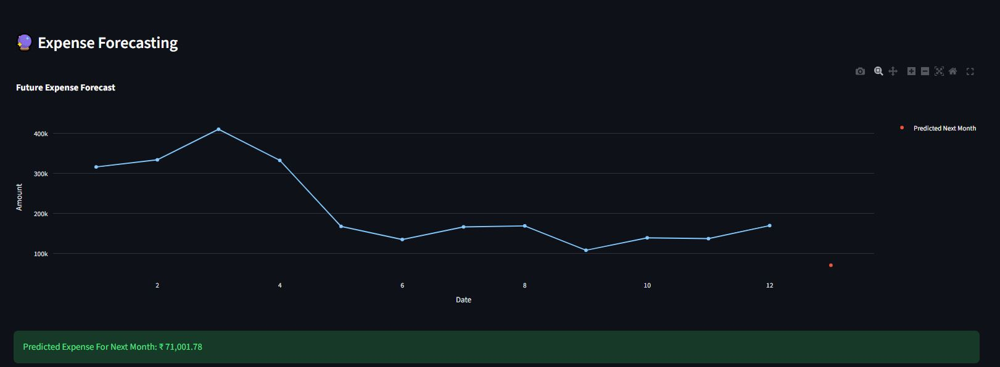

# 💰 FinSight AI – Personal Expense Tracker & Financial Analytics Dashboard

[](https://personal-expense-tracker-with-data-visualization-p2pdtj8jowkrm.streamlit.app/)

## 🚀 Live Demo
🔗 [Open FinSight AI Dashboard](https://personal-expense-tracker-with-data-visualization-p2pdtj8jowkrm.streamlit.app/)

---

FinSight AI is an advanced AI-powered Personal Expense Tracker built using **Python, Streamlit, Plotly, Pandas, and Machine Learning**. The dashboard helps users track expenses, analyze spending behavior, visualize financial trends, monitor budget usage, and forecast future expenses using predictive analytics.

---

## 🚀 Features
- 📊 Interactive Financial Dashboard  
- 🤖 AI Financial Insights  
- 🔮 Expense Forecasting using Machine Learning  
- 🎯 Budget Tracking System  
- 🔥 Spending Heatmap Visualization  
- 💳 Payment Method Analysis  
- 📈 Monthly Spending Trend Analysis  
- 📂 Downloadable Filtered Dataset  
- 🌙 Modern FinTech Dark UI  

---

## 🛠️ Tech Stack
**Python • Pandas • NumPy • Streamlit • Plotly • Scikit-learn • Matplotlib • Seaborn**

---

## 📸 Dashboard Preview

### 🔥 Full Dashboard


### 📈 Expense Insights


### 🔥 Spending Heatmap


### 🔮 Expense Forecasting


---

## ⚙️ Installation & Run

```bash
git clone https://github.com/jatingujju/Personal-Expense-Tracker-with-Data-Visualization.git

cd Personal-Expense-Tracker-with-Data-Visualization

python -m venv venv

venv\Scripts\activate

📈 Key Analytics

✅ Expense Forecasting
✅ AI Financial Recommendations
✅ Category-wise Spending Analysis
✅ Monthly Trend Analysis
✅ Budget Utilization Tracking
✅ Interactive Visualizations
✅ Financial KPI Dashboard

🎯 Future Improvements
PDF Report Generation
Expense Anomaly Detection
AI Chatbot Assistant
Authentication System
Cloud Database Integration
Mobile Responsive Dashboard
👨‍💻 Author
Jatin Gujarathi

Built with ❤️ using Python, Streamlit & Machine Learning
pip install -r requirements.txt

streamlit run app/dashboard.py
